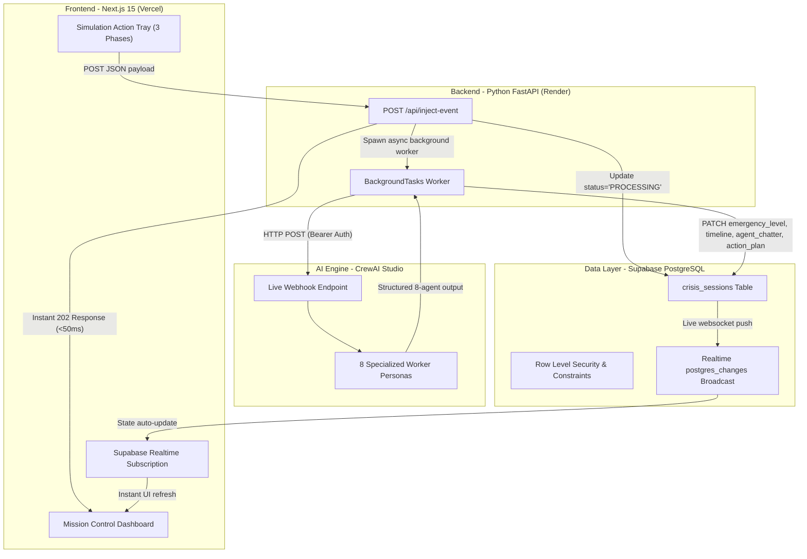

# 🚨 Emergency Response Commander AI

**Tactical Decision-Support EOC Dashboard • 8-Agent Neural Network Orchestration Pipeline**

An enterprise-grade, real-time tactical decision-support dashboard designed to solve information paralysis during massive urban crises. It aggregates disparate data streams, runs an asynchronous background orchestration pipeline across 8 specialized AI personas (via **CrewAI Studio**), and pipes structured, dynamic tactical recommendations down to human operations chiefs.

---

## 🏗️ Architecture & Technology Stack



### 1. Frontend: Next.js 15 (App Router) + Tailwind CSS v4
- **High-Contrast Tactical Dark Theme**: Built with deep space black (`#050810`), slate gray cards, neon red critical alerts (`#ff2d55`), and amber warning glows (`#ffbe0b`).
- **3-Column Mission Control HUD**:
  - **Left Column (Incident Intel)**: Flashing status card with scan-line animations and an animated vertical timeline feed.
  - **Middle Column (Live Agent Network)**: 2×4 grid showing active tool-calling insights from 8 distinct AI personas.
  - **Right Column (Tactical Directives)**: Numbered 5-step prioritized action plan with staggered entrance animations and progress indicator.
- **Sticky Simulation Control Tray**: 3 scenario execution buttons that inject realistic multi-paragraph crisis events (Earthquake, Dam Failure, Grid Collapse).
- **Zero-Reload Realtime State**: Uses `@supabase/supabase-js` realtime channel listeners (`postgres_changes`) to stream live state transitions directly into the React component tree.

### 2. Backend: Python FastAPI + Async Background Tasks
- **Responsive Orchestration Wrapper**: The `/api/inject-event` endpoint updates Supabase and returns within milliseconds to keep the dashboard responsive while AI evaluation happens asynchronously.
- **CrewAI Webhook Integration**: Uses `httpx.AsyncClient` with a 120-second timeout to invoke the published CrewAI Studio pipeline with proper Bearer token authentication.
- **Defensive Parser & Fallback Engine**: Parses structured JSON responses and patches Supabase rows. If the external CrewAI webhook is unreachable or times out during development, it automatically falls back to `mock_response.json` so the UI always renders data.

### 3. Data Layer: Supabase PostgreSQL + Realtime
- **JSONB Schema Evolution**: Tracks dynamic event timelines, agent chatter arrays, and tactical directives using PostgreSQL `JSONB` columns.
- **Row Level Security (RLS)**: Configured with policies for frontend anonymous reads/inserts and service-role backend full access.

---

## 👥 The 8-Agent Architecture

The orchestration pipeline coordinates 8 specialized AI worker personas:
1. 🧑‍✈️ **Incident Commander**: Declares emergency levels, activates Unified Command, and allocates tier-1 resources.
2. 🚑 **Medical Coordinator**: Filters regional hospital bed databases, tracks blood bank inventory, and deploys mobile triage units.
3. 🚒 **Fire Chief**: Tracks HAZMAT/gas vapor plumes, manages engine companies, and coordinates USAR team entrapment rescues.
4. 🚦 **Traffic Planner**: Scans signal network blackouts, analyzes bridge stress fractures, and computes civilian evacuation routing.
5. 🌦️ **Tactical Weather Analyst**: Calculates wind-driven plume dispersion vectors and heavy precipitation flood complications.
6. 📦 **Strategic Logistics Officer**: Dispatches generator fuel tankers from regional reserves and stages FEMA shelter supplies.
7. 📢 **Public Information Officer**: Queues Wireless Emergency Alerts (WEA), scales 311 multilingual call centers, and counters misinformation.
8. ☢️ **HAZMAT Specialist**: Simulates toxic chemical plume boundaries and establishes Level-A containment protocols.

---

## 🚀 Getting Started

### Prerequisites
- **Node.js** 20+ and npm
- **Python** 3.10+
- **Supabase Account** with a provisioned project

### Step 1: Database Setup
1. Open your Supabase Project Dashboard and navigate to the **SQL Editor**.
2. Copy and paste the contents of `supabase/schema.sql` and run the script.
3. **IMPORTANT**: Navigate to **Database → Replication** in the Supabase Dashboard and toggle **ON** replication for the `crisis_sessions` table so live websocket pushes work.

### Step 2: Backend Setup (FastAPI)
```bash
cd backend

# Create virtual environment
python -m venv .venv
# On Windows:
.venv\Scripts\activate
# On Linux/macOS:
# source .venv/bin/activate

# Install dependencies
pip install -r requirements.txt

# Configure environment variables (copy values from your project credentials)
# Edit .env file with your Supabase keys and CrewAI webhook credentials
```

Start the FastAPI server:
```bash
uvicorn main:app --reload --port 8000
```
The backend API will be available at `http://localhost:8000` (Swagger UI at `/docs`).

### Step 3: Frontend Setup (Next.js)
```bash
cd frontend

# Install Node dependencies
npm install

# Start development server
npm run dev
```
Open `http://localhost:3000` in your browser to launch the Mission Control HUD.

---

## ⚡ Simulation Testing Guide

At the bottom of the dashboard, use the **Simulation Control Tray** to test the full loop:
- **Phase 1: Initial Earthquake**: Injects a 7.2 magnitude earthquake report with bridge fractures, hospital grid severance, and gas line ruptures.
- **Phase 2: Dam Failure Warning**: Injects a catastrophic structural integrity warning from Silver Lake Dam with flood arrival projections.
- **Phase 3: Grid Collapse Overload**: Injects a cascading regional blackout report affecting 14 substations and telecommunications networks.

When clicked, observe:
1. The emergency badge instantly shifts from `STANDBY` to `PROCESSING INTEL` with an amber pulsing spinner.
2. The event appears in the **Incident Timeline**.
3. Once AI processing finishes, the dashboard automatically updates without a page reload, displaying color-coded emergency levels, 8-agent tool-calling insights, and the 5-step action plan.

---

## 🌐 Deployment Guidelines

### Frontend (Vercel)
1. Import the `frontend` folder into a new Vercel project.
2. Add environment variables in Vercel settings:
   - `NEXT_PUBLIC_SUPABASE_URL`
   - `NEXT_PUBLIC_SUPABASE_ANON_KEY`
   - `NEXT_PUBLIC_API_URL`: Set to your deployed Render backend URL (e.g., `https://emergency-api.onrender.com`).

### Backend (Render)
1. Create a new **Web Service** on Render pointing to the `backend` folder.
2. Set Build Command: `pip install -r requirements.txt`
3. Set Start Command: `uvicorn main:app --host 0.0.0.0 --port $PORT`
4. Add environment variables:
   - `SUPABASE_URL`
   - `SUPABASE_SERVICE_KEY`
   - `CREWAI_WEBHOOK_URL`
   - `CREWAI_BEARER_TOKEN`
